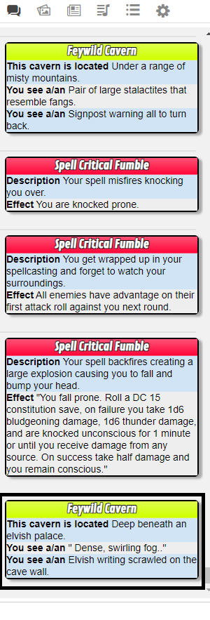
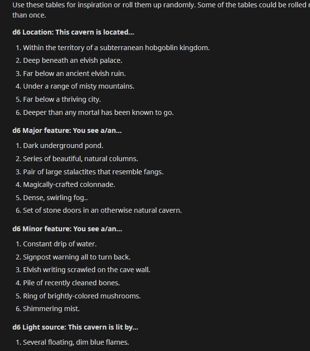
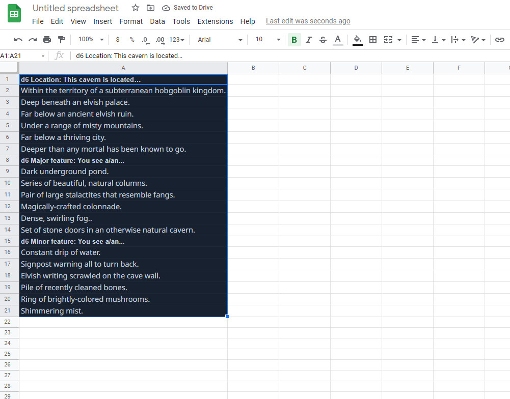
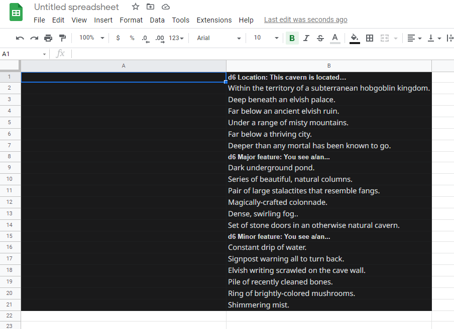
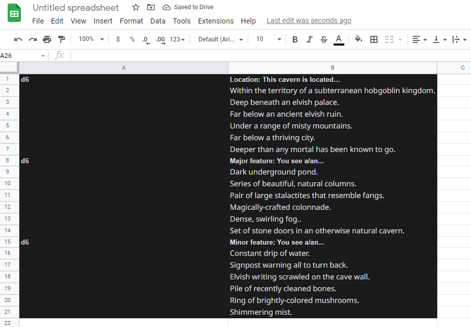
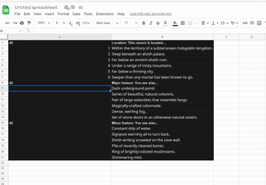
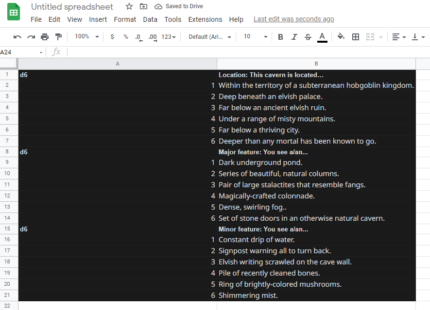

# Cardtable
Convert your rollable table results into nice shiny Scriptcards (Credit: @Kurt Jaegers)
## 1. What does it do?

What if rolling on this (credits [u/OrkishBlade](https://www.reddit.com/r/BehindTheTables/comments/61ls8l/feydark_caverns/) on reddit)-

d6 This cavern is located
1. Within the territory of a subterranean hobgoblin kingdom.
2. Deep beneath an elvish palace.
3. Far below an ancient elvish ruin.
4. Under a range of misty mountains.
5. Far below a thriving city.
6. Deeper than any mortal has been known to go.

d6 You see a/an
1. Dark underground pond.
2. Series of beautiful, natural columns.
3. Pair of large stalactites that resemble fangs.
4. Magically-crafted colonnade.
5. Dense, swirling fog..
6. Set of stone doors in an otherwise natural cavern.

d6 You see a/an<br>
1. Constant drip of water.<br>
2. Signpost warning all to turn back.<br>
3. Elvish writing scrawled on the cave wall.<br>
4. Pile of recently cleaned bones.<br>
5. Ring of brightly-colored mushrooms.<br>
6. Shimmering mist.

Gave you something like this (example rolls on a different table are also shown in the image)-



*That is it.* This is the purpose of this script. I wanted some rollable tables which were a bit more fun, whithout having to go through the hassle of creating powercards manually for the tons of random tables I roll for my players.

* Once you have your table in a spreadsheet, all you need to do is save it, and then copy and paste it in the chatbox following the instructions
* This script will automatically parse the chat message and create a macro for you which will have a scriptcard which can do everything you need from the table
* A bunch of edge cases have been tested out and accounted for to allow for some mistakes in the data entry (but it is advisable to follow the instructions as closely as possible)
* Scriptcards and CardTables both need to be active in your game


## 2. Data format
The data needs to be entered in a specific format for this to work

```javascript
!cardtable{{ //This is to call the API
  x-table-name //This is the name that your macro will have. More in section 2.1
  dice\tcolumn1\tcolumn2\tcolumn3\t...... //This is the table header. More in section 2.2
  roll\tvalue1\tvalue2\tvalue3\t...... //This is one row of the table. More in section 2.3
  .
  .
  .
  ---------- // This separates tables if there are multiple tables to roll. More in section 2.4
  dice\tcolumn1\tcolumn2\tcolumn3\t......
  roll\tvalue1\tvalue2\tvalue3\t......
  .
  .
  .
}} //This is to close the command block
```

### 2.1 Table name
Table name has to be **ALWAYS** of the format `x-table-name`. Not following this format will result in wonky cards. No one wants that. Here is what each part of the table name means-

* `x` - Replace this with `s` or `m` depending on your tables. This is an identifier which tells the script whether a single table will be rolled (`s`) or multiple ones (`m`). E.g. - The example in the last section is an example of an `m` type table

* `table-name` - This is the actual name of the table. It needs to be separated by hyphens with no whitespaces. E.g. - For the Feydark caverns tables in the last section, the table-name might be `feydark-caverns`

The full table name line for the example would thus be - `m-feydark-caverns`

### 2.2 Table Header
This is the line of the table that identifies what dice will be rolled and what the names of each of the columns are. **EVERY COLUMN OF THE TABLE NEEDS TO BE SEPARATED BY THE TAB CHARACTER (denoted by \t above)**. This can be done automatically in whichever spreadsheet software you prefer.

* **First column** - The dice to be rolled. Of the format (dX or dX+dY+....). **THERE SHOULDN'T BE A LEADING 1 IN HERE (❌1d20❌ ✅d20✅)**
* **Other columns** - The next columns. They should contain the Name for whatever values are in that column

E.g. - The table header for the first table in the example above would look like

````
d6\tThis cavern is located

````

### 2.3 Table Rows
All of the table rows follow the same rules. **THE COLUMNS NEED TO BE SEPARATED BY A TAB CHARACTER**.

* **First column** *The roll* - The first column corresponds to the roll required for that row to be selected. Can be a number (like in the example above) or a range of numbers separated by a hyphen (`3-7`,`09-14`)

* **Next columns** *The values* - These should contain the values to be displayed if that roll comes up.

E.g. - An example row from the first table in the example above -

````
3.\tFar below an ancient elvish ruin.
````

### 2.4 Separating Multiple Tables
Like in the example above, sometimes rolling on multiple tables might be necessary to get the final result. Instead of having to run a different rollable table or call a different macro for each of them, all of the connected tables can be grouped into one input.

Each of these tables can be separated by `-----` (**5 hyphens or more**)

E.g. - Given all the information in this section, the example from earlier, in it's entirety will look something like -

````
!cardtable{{
m-feywild-cavern
d6	This cavern is located
1	 Within the territory of a subterranean hobgoblin kingdom.
2	 Deep beneath an elvish palace.
3	 Far below an ancient elvish ruin.
4	 Under a range of misty mountains.
5	 Far below a thriving city.
6	 Deeper than any mortal has been known to go.
------
d6	You see a/an
1	 Dark underground pond.
2	" Series of beautiful, natural columns."
3	 Pair of large stalactites that resemble fangs.
4	 Magically-crafted colonnade.
5	" Dense, swirling fog.."
6	 Set of stone doors in an otherwise natural cavern.
------
d6	You see a/an
1	 Constant drip of water.
2	 Signpost warning all to turn back.
3	 Elvish writing scrawled on the cave wall.
4	 Pile of recently cleaned bones.
5	 Ring of brightly-colored mushrooms.
6	 Shimmering mist.
}}

````

Getting to this point might seem like a lot of steps but I will go through a couple of examples and it should seem really simple by the end. **Most of the processing is handled by your spreadsheet software automatically, and most or the remaining is handled by CardTable**. Only a very minor bit of manual processing is required.

## 3. Example table 1
Let's say we want to convert the table I showed in the example above into a ✨card table✨.


### Step 1 - Copy the tables into a spreadsheet
Just copy all the relevant text into a spreadsheet. I am using google docs for this example because it is 🌟free🌟

Once you have copied everything, it should look like this-



Some tables you copy might have the rolls and the values already separated into different columns. But unfortunately this one doesn't.

Now go to *Insert>Columns>Insert 1 column left* and click on it.


It should look somewhat like this now -



Now as you can see the dice name and the column name are all lixed up in one cell. Clean that up by manually removing it from that cell and putting it as the header of the first column (section 2.2). Since there are three tables in this example, do this for each of them



Fill out the first column accordingly. SInce here it is just simple ranges of numbers, it is pretty easy to do. First fill out a couple of rows, then drag and select the rows that you just filled. Then drag the bottom right of the selection (that corner should have a tiny square on it) to fill out the remaining rows. A short demonstration -



Fill out all the tables like this and you should be ready to save it.


