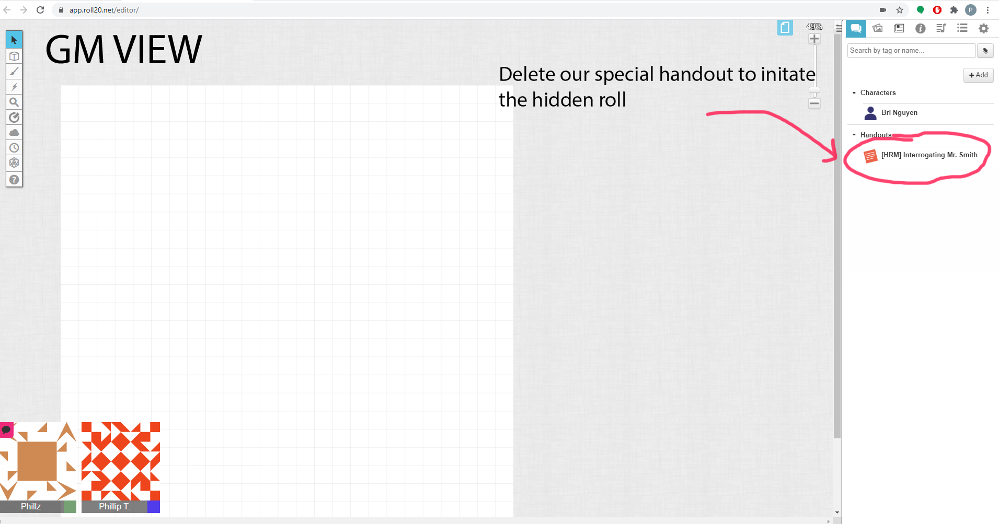
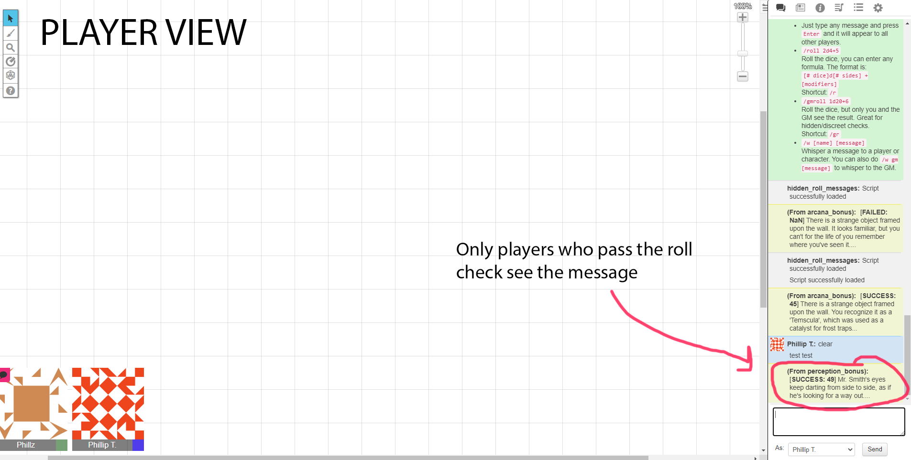
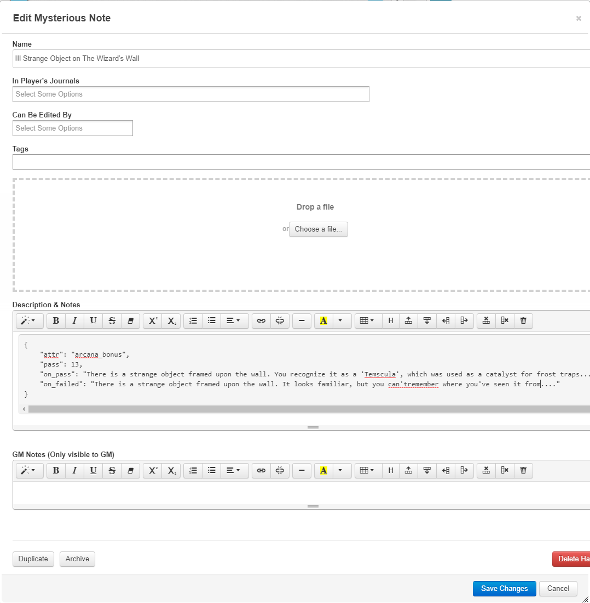

# Hidden Roll Messages

## Description
---------------
Inspired by Disco Elysium, this script will roll a check for all player in the background then whisper the player with some information if they pass the check. The information needed to evaluate this check will be passed as json data in the 'notes' portion of a custom handout object.  This script was designed to allow GMs to easily and quickly pass information to a user based on a roll without slowing the flow of the game.

## Goal
-----------------
This plugin seeks to increase immersion and role playing! With this system, DM's can roll and send messages quickly without having to slow the pace of the game down or stop what they are doing. This also allows DMs quickly and selectively choose who the information goes to without taking the time to whisper. 

Some scenearios where this plugin would enhance the experience: 

1. At the begining of the campaign where the DM is giving the players a brief history of the world, she can use this plugin to roll for History and give background details to those who pass the role, all without needing to stop talking. 

2. The players are interrogating the castle guard, the DM can use this plugin to roll for perception and notice if the guard is behaving shifty in the middle of the conversation without having to stop and manually roll. Even better if not all players pass the roll, therefore the players who did pass can turn to the party and be like "Hey did you notice that so-and-so was behaving weirdly??" 


## Screen Shots 
-----------------




## User Config
-----------------
In the scripts.json you can configure 2 main variables

```
dice_sides (integer) -> what kind of dice to roll for the hidden roll

HRM_identifier (string) -> The identifier you wish to use to denote a handout as an [HRM] handout
```

## Commands
----------------
The script is mostly controlled by creating and deleting handouts with our identifiers but we do have one api command you can type 

```
!hrm play <name of the handout> -> plays the handout with name <name of the handout>. Use this command if you want to play a handout without deleting it.
```

## Usage 
----------------
Once the script is installed, we need to create a \[HRM\] handout. We do this by creating a new handout and typing in our HRM_identifier (default: !!!) followed by a name. This name is arbritary but I reccomend something to remind the GM the context of this hidden dice roll. Next in the "notes" section of the handout, we want to write some JSON (just a style of formatting text). 

The format of notes should be as follows: 

```
{
    "attr": <some attribute name>,
    "pass": <some numerical value>,
    "on_pass": <some message>,
    "on_failed": <some message>
}
```

**attr:** The attribute value one wants to add to the dice roll. Note that this attribute MUST exist within the attribute section of a character sheet and MUST be spelled the exact way it is found in the attribute section of a character sheet. 

**pass:** The value needed to pass the check 

**on_pass:** The message the system will whisper to the player that passes the check 

**on_failed:** (OPTIONAL) The message the system will whisper to the player that fails the check

### Example
Let's say we are playing DnD and we are investigating a wizard's lair. As the players are walking down an alley, there is a strange object hanging on the wall. We want to create an HRM that rolls for Arcana and if the roll succeeds, the player will get a whisper telling them what that object is. 

Here is what the handout should look like: 


Once you are done, save the handout. Now one of two things will happen. 

1. The handout will be created successfully and the HRM_identifier portion of the name will be replaced with \[HRM\]. In this case, good job it's all set to go! 

2. If unsuccessful, the handout will be renamed "Invalid JSON Handout" and you'll get a message noting it failed. I reccomend using a JSON linter(https://jsonformatter.curiousconcept.com/) to see what the issues were. Most often it's the users add an extra comma to the last element in their JSON. 

Now to run the roll, simply delete the handout and the you should see a message telling you which players passed the check (if you are the GM) or the corresponding "on_pass" or "on_fail" messages 

If you need to change the HRM after creation, you can simply edit it and the system will update
<b> if you change the name of the HRM after creation though, make sure the new name still has the [HRM] tag at the front </b>
Also, before you submit changes, make sure the JSON is correct or else the program will complain and you'll have to remake it ;)

### Other Important Notes
### Important note on testing 
The program will NOT roll for any characters controlled by the GM! So to see the results from a Player's perspective, you may need to create a second account and join the room or get a friend to help you. 
#### How are rolls calculated?
-------------------------
The system calculates the roll using the following formula:

```
    roll_result = (random number between 1 and dice_sides) + (value of "attr" specified in the JSON) 
```

This makes sense in a game like DnD, where every roll is 1d20 + some modifier value. However, for a system like Gumshoe or Call of Cthulu, this would be problematic since in those systems the results are based on whether or not your skill value is above a threshhold. 

This is why I allow users to customize the dice_sides to adjust for the different systems. In the case of Gumshoe style systems, we can change the dice_sides to 0 and simply use the skill value as the "attr" in our JSON.

TL;DR I didn't think of how to impliment every system, but hopefully the system is robust enough that you (the user) can adapt to it. If not, send me a Issue request and I'll look into it!

### Known Issues
1. If the user for whatever reason removes the \[HRM\] tag from the name, the roll will not run when the handout is deleted. Even worst is on the backend will use memory for that handout forever. Probably not an issue unless you do this like 10000000 times, but still worth noting.
2. If you put in a attribute that doesn't exist for the json. You will always fail that roll.